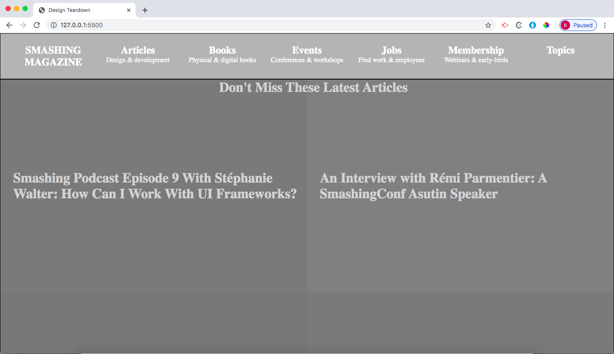

# Design-Teardown

# What it does
In this project, we created a grayscale heat map of the website for <a href="https://www.smashingmagazine.com"> Smashing Magazine</a>. The goal of this project was to indicate the elements with the greatest weight in the visual hierarchy.

## Built With
- HTML
- CSS
#### and deployed to Github

## Live Demo

[Live Demo](https://dazzling-aryabhata-a680c0.netlify.com/)

## Getting Started

To get a local copy up and running follow these simple example steps.
- Clone the project unto your local machine
- `cd` into the project directory
- Open up index.html in your browser to view the project

## Authors

## Brittany Blake

-Github: [@BrittanyBlake](https://github.com/BrittanyBlake)
-Twitter: [@bbcodes_](https://twitter.com/bbcodes_)
-Linkedin: [Brittany Blake](https://www.linkedin.com/in/brittany-blake-843951109/)

## Ritta Buyaki

-Github: [@Buyaki01](https://github.com/Buyaki01)
-Twitter: [@BuyakiRitta](https://twitter.com/BuyakiRitta)
-Linkedin: [Ritta Buyaki](https://www.linkedin.com/in/ritta-buyaki-b12904128/)

## 🤝 Contributing

Feel free to check the [issues page](https://github.com/BrittanyBlake/Design-Teardown/issues).

## Attributions and Credit
Special thanks to Microverse!

## Show your support

Give a ⭐️ if you like this project!

## 📝 License

This project is licensed by Microverse.

### Enjoy!
